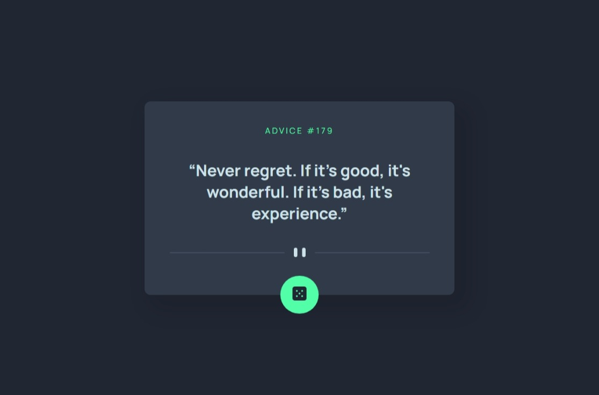
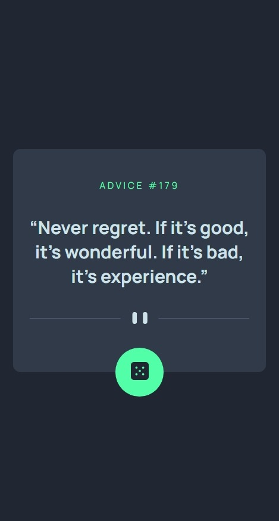

# Advice generator app component

This is a solution to the [Advice generator app challenge on Frontend Mentor](https://www.frontendmentor.io/challenges/advice-generator-app-QdUG-13db/). 

## Screenshot

### Desktop Mode


### Mobile Mode


## Links
- Live Site URL: [advice-generator-app-mh.netlify.app](https://advice-generator-app-mh.netlify.app/)

## Usage

```bash
  git clone https://github.com/MrMohammedMath/advice-generator-app.git

  cd advice-generator-app

  npm install

# for running dev server
npm run start

#for build & review
npm run build
npm install -g serve
serve -g build
```

## Built with

- Semantic HTML5 markup
- Flexbox
- Mobile-first workflow
- [SCSS](https://sass-lang.com/s) - Superset of CSS
- [BEM](https://en.bem.info/) - Block Element Modifier
- CSS module
- [React](https://reactjs.org/) - JS library

## Author

  Frontend Mentor - [@Mohammed Hassan](https://www.frontendmentor.io/profile/MrMohammedMath)

## Acknowledgments
Inspriation by [Frontend Mentor](https://www.frontendmentor.io/home)